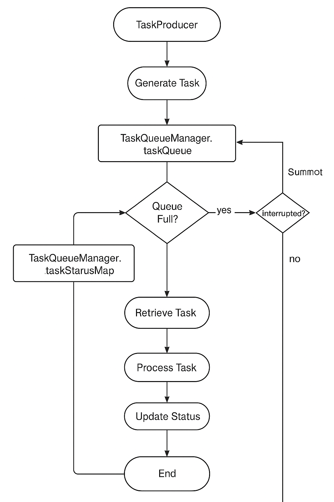

# 🧵 ConcurQueue – A Multithreaded Job Dispatch System

ConcurQueue is a simulated backend task dispatch platform built with **core Java concurrency**. It demonstrates a real-world, high-performance **producer-consumer** system using multithreading, blocking queues, task prioritization, and runtime monitoring.

## 🚀 Features

- ✅ Multiple producer threads generating tasks at random intervals
- ⚙️ Worker pool consuming and processing tasks concurrently
- ⏫ Task prioritization (using random or fixed priority values)
- 🔁 Task retry mechanism (up to 3 times)
- 🛑 Bounded queue: producers block if queue is full
- 🕵️ Real-time monitoring: logs queue size, task state, pool activity
- 🧠 Demonstrates synchronization, atomic counters, race condition protection
- 🧼 Graceful shutdown and interrupt handling
- 🧪 Unit & integration testing using JUnit + Awaitility

## 🗂️ Package Structure

```
src/
├── producer/
│   └── TaskProducer.java
├── consumer/
│   └── TaskConsumer.java
├── monitor/
│   └── SystemMonitor.java
├── model/
│   └── Task.java, TaskStatus.java
├── utils/
│   └── TaskQueueManager.java, LoggerService.java
├── Main.java
```

## 🛠️ Technologies Used

- Java 17+
- Core Java Concurrency (`Thread`, `ExecutorService`, `BlockingQueue`, `AtomicInteger`)
- JUnit 5
- Awaitility (for async/concurrent test assertions)

## 📦 Task Model

```java
Task {
  UUID id;
  String name;
  int priority;
  Instant createdTimestamp;
  String payload;
  int retryCount;
}
```

## ⚙️ How It Works

1. **Producers** generate N random tasks per batch (1 ≤ N ≤ 5), sleep, and repeat.
2. **Bounded Blocking Queue** holds tasks (capacity = 100). Producers block when full.
3. **Worker Pool (Consumers)** fetch tasks, simulate processing, and mark them as `COMPLETED`, or retry up to 3 times.
4. **Task Status Map** tracks each task's state: `SUBMITTED`, `PROCESSING`, `COMPLETED`, `FAILED`.
5. **System Monitor** logs runtime statistics every 5 seconds:
   - Queue size
   - Tasks processed
   - Thread pool usage
   - Remaining capacity

## 🧪 Running the System

### Compile and Run

```bash
javac -d out $(find src -name "*.java")
java -cp out org.example.Main
```

Or use your IDE's run configuration (Main class: `org.example.Main`).

## 🧪 Running Tests

```bash
mvn test
```

### Activity Diagram




> Tests use Awaitility to validate async behavior.

## 📊 Sample Monitor Log

```
[Monitor] Queue size: 12 | Remaining Capacity: 88 | Tasks processed: 43
| Active Consumers: 5 | Pool Size: 5 | Idle Threads: 0
| Total Submitted: 57 | Completed by Pool: 0
```

## 🔒 Graceful Shutdown

The application installs a shutdown hook that:
- Interrupts producer and monitor threads
- Shuts down worker pool
- Prevents task loss

## 📌 Key Learning Outcomes

- Understand the Java Memory Model
- Prevent race conditions with `AtomicInteger`, `synchronized`, and `volatile`
- Build safe, concurrent pipelines using BlockingQueues
- Design retry logic and failure handling
- Monitor and debug multithreaded systems

## 📁 Future Improvements

- Export task status to JSON/CSV every minute
- Web dashboard using REST or WebSocket
- Metrics: task latency, retry rates
- Deadlock simulation and resolution
- JMX / Prometheus integration

## 👨‍💻 Author

Richmond Kwame Nyarko  
Project for NovaTech Solutions' Backend Concurrency Lab

## 📝 License

MIT License